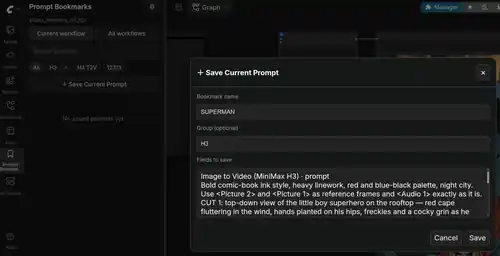
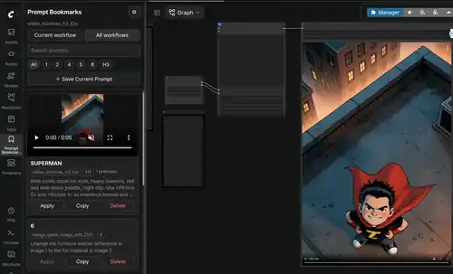

# ComfyUI Prompt Bookmarks

<p align="center">
  <strong>A lightweight, dependency-free personal prompt organizer for ComfyUI.</strong><br>
  Bookmark, group, search, copy, and restore prompts directly from the sidebar — without adding nodes or cluttering your canvas.
</p>

<p align="center">
  <a href="README.md">English</a> · <a href="README.zh-CN.md">简体中文</a>
</p>

<p align="center">
  
  
  
  
</p>

## Screenshots

### Save the current prompt without touching the workflow graph



### Browse saved prompts with generated image/video previews in the sidebar



## Why Prompt Bookmarks?

ComfyUI makes it easy to experiment with prompts, but good prompts often end up scattered across workflow files, text notes, chat history, or copy-paste snippets.

**ComfyUI Prompt Bookmarks** is a small sidebar extension focused on one job: **organizing your own reusable prompts inside ComfyUI**.

- **Lightweight** — no framework runtime and no heavy service layer.
- **No extra dependencies** — no additional Python packages to install; the backend uses the Python standard library, including `sqlite3`.
- **No extra workflow nodes** — it does not add loader/saver nodes to your graph.
- **No canvas clutter** — everything lives in the ComfyUI sidebar.
- **Personal-first** — designed as a private prompt library/bookmark manager, not a marketplace or cloud service.
- **Workflow-aware** — remember which prompt fields belong to each workflow and restore them with one click.

If you are searching for a **ComfyUI prompt manager**, **prompt library**, **prompt organizer**, or **prompt bookmark sidebar**, this project is intentionally built to stay simple and out of the way.

## Features

- Sidebar-first prompt library with **no added workflow nodes**
- English and Simplified Chinese UI
- Automatically follows the active workflow, including workflows whose template UUIDs collide
- Visual prompt-field picker — select fields with checkboxes; **no node IDs need to be entered manually**
- Smart prompt/text field recommendations while keeping Note/Markdown fields unchecked by default
- **Locate** action to jump to the source node on the canvas
- Normal ComfyUI group path display
- Supports editable text widgets exposed by Group Nodes / Subgraphs
- Save multiple fields as one bookmark, such as:
  - main prompt
  - motion/camera prompt
  - negative prompt
- Organize prompts by **workflow + group**
- Delete empty groups safely
- Search saved prompts
- One-click restore/apply inside the matching workflow
- Copy prompts from any workflow, with a clipboard fallback for non-secure/local HTTP environments
- SQLite persistence under the ComfyUI user directory
- Best-effort automatic image/video preview linking after successful executions
- Generated media is referenced, **not duplicated**

## Installation

### ComfyUI Manager

The project includes Comfy Registry metadata and is being prepared for ComfyUI Manager discovery. Once listed, search for:

```text
ComfyUI Prompt Bookmarks
```

or:

```text
Prompt Bookmarks
```

### Manual installation

```bash
cd /path/to/ComfyUI/custom_nodes
git clone https://github.com/vdeng-ai/ComfyUI-Prompt-Bookmarks.git
```

Restart ComfyUI and refresh the browser. A bookmark icon will appear in the sidebar.

**No `pip install`, `requirements.txt`, Node.js package install, or build step is required for normal use.**

## Quick start

1. Open a workflow in ComfyUI.
2. Open **Prompt Bookmarks** from the sidebar.
3. Click **Choose Prompt Fields**.
4. Confirm the editable text fields you want to save together.
5. Click **Save Current Prompt**.
6. Give it a name and optional group.
7. Later, click **Apply** to restore those fields or **Copy** to reuse the text elsewhere.

Prompt Bookmarks stores node IDs and widget names internally only so it can find the selected fields again. You never need to manage those identifiers yourself.

## What it does not do

Prompt Bookmarks intentionally stays small. It does **not** try to become a workflow manager, model manager, prompt marketplace, cloud sync service, or AI prompt rewriting tool.

It also does not save sampler/model/seed/CFG settings as part of a prompt bookmark. The focus is your **prompt text library**.

## Groups, Group Nodes, and Subgraphs

Prompt Bookmarks follows a conservative compatibility rule:

- **Normal canvas groups** — fully transparent. The picker shows group paths such as `Video Generation › Character Prompt › text`.
- **Group Nodes / Subgraphs with exposed text widgets** — supported through the widgets visible on the outer node.
- **Hidden internal Subgraph widgets** — not modified directly. Expose the desired field first.

This avoids fragile deep graph bindings and keeps the extension compatible with changing ComfyUI frontend internals.

## Language

Use the sidebar gear menu or the PromptBookmarks section in ComfyUI Application Settings:

- **Auto** — follows the ComfyUI/browser language when possible
- **简体中文**
- **English**

## Automatic previews

After a successful execution, Prompt Bookmarks can read ComfyUI history, reconstruct the configured prompt fields, match them against saved prompt fingerprints, and associate matching generated media with the bookmark.

Media files are **not copied** into the plugin database. Prompt Bookmarks stores references to existing ComfyUI output files.

Common image outputs are supported, plus MP4, WebM, MOV, MKV, and M4V when the output exposes ComfyUI-style file metadata.

## Data location

Your prompt library is stored outside the custom-node repository:

```text
<ComfyUI user directory>/prompt_bookmarks/prompt_bookmarks.db
```

Updating, replacing, or reinstalling this repository does not remove your saved prompts.

## Compatibility notes

- Prompt discovery works with editable string widgets visible on the active/root canvas.
- Hidden internal Subgraph fields must be exposed first.
- Cross-workflow **Copy** is supported.
- Cross-workflow **Apply** is disabled by design to avoid writing to unrelated node layouts.
- Automatic media association is best-effort and never blocks generation.

## Development

Backend tests require no third-party packages:

```bash
python -m unittest discover -s tests -v
```

Frontend syntax check:

```bash
for file in web/*.js; do node --check "$file"; done
```

See [docs/DEVELOPMENT_PLAN.md](docs/DEVELOPMENT_PLAN.md) for the implementation roadmap.

## Comfy Registry / Manager metadata

Registry metadata lives in [`pyproject.toml`](pyproject.toml). The repository also includes a manual GitHub Actions workflow for publishing a tagged/versioned release to the Comfy Registry after a maintainer configures `REGISTRY_ACCESS_TOKEN`.

ComfyUI Manager supports both its node database and the official Comfy Registry during the ongoing transition. See the official Manager documentation for current publishing/discovery behavior.

## License

MIT
